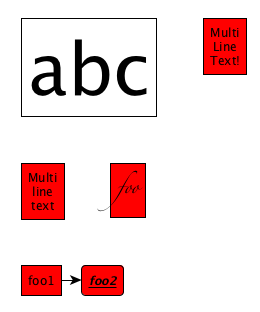
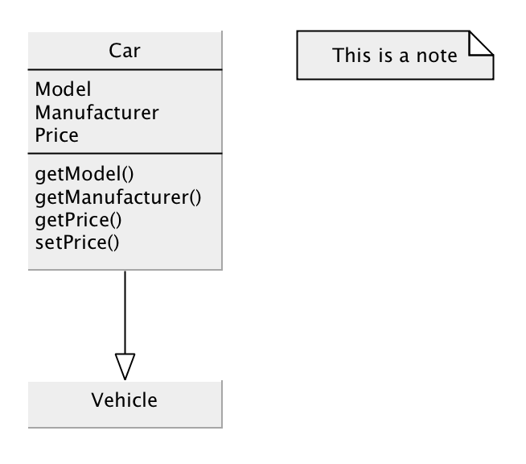

# yEd Py

A simple Python library to export networks to [yEd](http://www.yworks.com/en/products_yed_about.html).

Is is [available from PyPI](https://pypi.org/project/pyyed/).

The [yEd Graph Editor](https://www.yworks.com/products/yed) supports the [GraphML](http://graphml.graphdrawing.org/) ([GraphML Primer](http://graphml.graphdrawing.org/primer/graphml-primer.html)) file format. 
This is an open standard based on XML, and is supported by Python libraries such as [NetworkX](https://networkx.github.io/).
However, the details of formatting (rather than network topology) are handled by yEd specific extensions to the standard, which are not supported by other libraries.
 
I therefore wrote this library to provide an easy interface that lets you specify how a graph should look, and generates corresponding graphML that can be opened in yEd.

## Usage
The interface is similar to that of NetworkX:

```python
import pyyed

g = pyyed.Graph()

g.add_node('foo', font_family="Zapfino")
g.add_node('foo2', shape="roundrectangle", font_style="bolditalic", underlined_text="true")

g.add_edge('foo1', 'foo2')
g.add_node('abc', font_size="72", height="100", shape_fill="#FFFFFF")

g.add_node('bar', label="Multi\nline\ntext")
g.add_node('foobar', label="""Multi
    Line
    Text!""")

g.add_edge('foo', 'foo1', label="EDGE!", width="3.0", color="#0000FF", 
               arrowhead="white_diamond", arrowfoot="standard", line_type="dotted")

print(g.get_graph())

# To write to file:
with open('test_graph.graphml', 'w') as fp:
    fp.write(g.get_graph())

# Or:
g.write_graph('example.graphml')

# Or, to pretty-print with whitespace:
g.write_graph('pretty_example.graphml', pretty_print=True)

```

Saving this to a file with a ``.graphml`` extension, opening in yEd, applying  ``Tools -> Fit Node to Label`` and ``Layout -> One-click layout`` produces something like the following:



### UML
The file ``demo.py``, includes an example UML diagram:



The arrowheads used in UML class diagrams diagrams correspond to ``crows_foot_one_optional`` (association or dependency), ``white_delta`` (inheritance or implementation), ``white_diamond`` (aggregation), and ``diamond`` (composition).

 The ``line_type`` is either ``line`` or ``dashed``.


## Options

Valid ``node shapes`` are: "rectangle", "rectangle3d", "roundrectangle", "diamond", "ellipse", "fatarrow", "fatarrow2", "hexagon", "octagon", "parallelogram", "parallelogram2", "star5", "star6", "star6", "star8", "trapezoid", "trapezoid2", "triangle", "trapezoid2", "triangle"

Valid ``line_types`` are: "line", "dashed", "dotted", "dashed_dotted"

Valid ``font_styles`` are: "plain", "bold", "italic", "bolditalic"

Valid ``arrow_types`` are: "none", "standard", "white_delta", "diamond", "white_diamond", "short", "plain", "concave", "concave", "convex", "circle", "transparent_circle", "dash", "skewed_dash", "t_shape", "crows_foot_one_mandatory", "crows_foot_many_mandatory", "crows_foot_many_optional", "crows_foot_many_optional", "crows_foot_one", "crows_foot_many", "crows_foot_optional"

## Development

Requirements:

    $ pip install pytest

Run the tests:

    $ PYTHONPATH=. pytest tests
